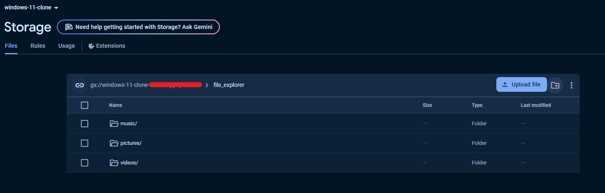
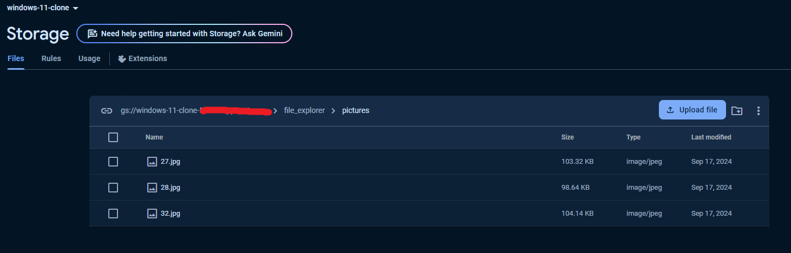
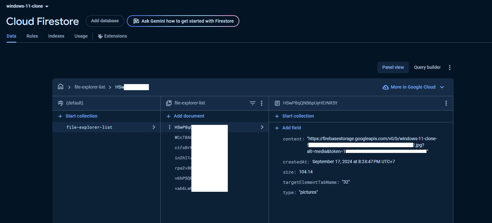
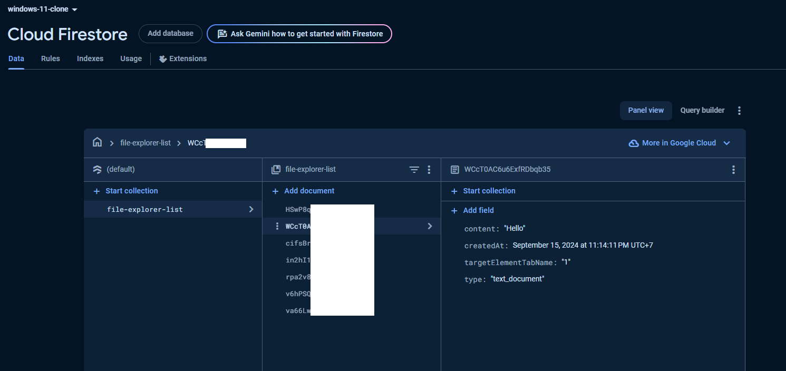
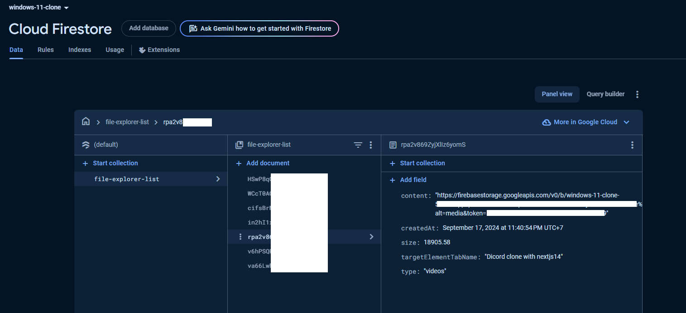
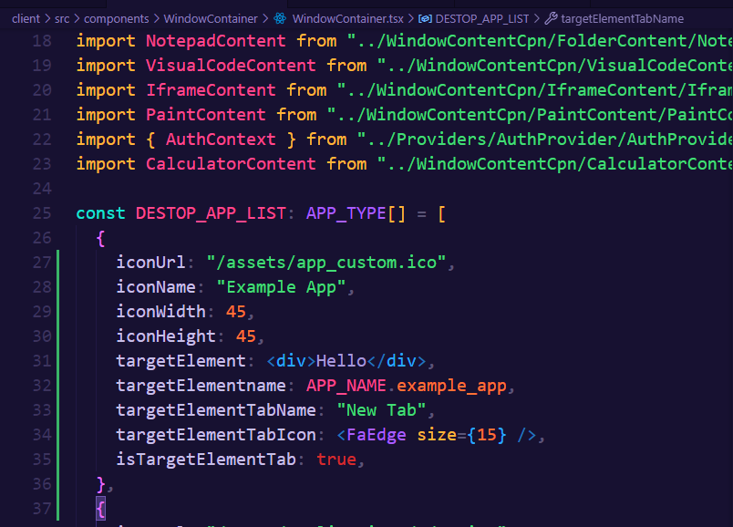
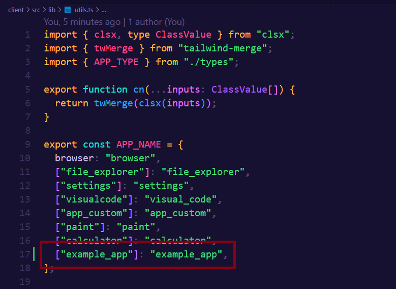
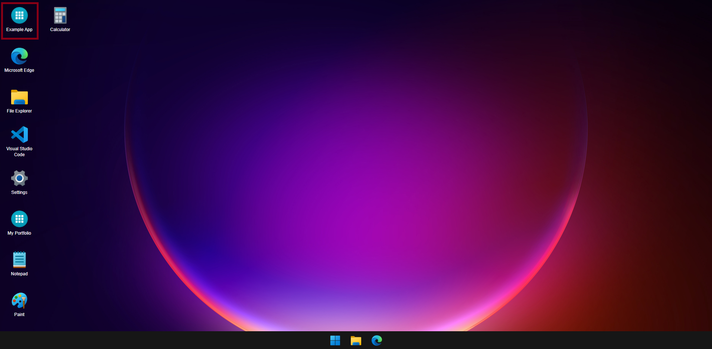
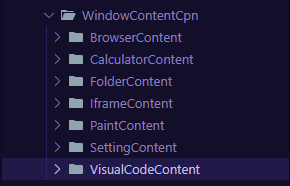

# WINDOWS 11 CLONE DOCUMENTATION

 

# 📋 Table of Contents

1. [Project Setup](#project-setup)
   1. [Firebase setup](#firebase-setup)
   2. [Source code setup](#source-code-setup)
2. [Developer Workspace](#developer-workspace)
   1. [Conflict npm packages](#conflict-npm-packages)
   2. [Add more apps](#add-more-apps)

## 💽 Project Setup <a name="project-setup"></a>

### 🔥 Firebase setup <a name="firebase-setup"></a>

- [This project use Firebase for some features (Click to see basic setup).](https://mydevpa.ge/blog/how-to-setup-firebase-firestore-with-nextjs-14)
- This project doesn't have server, so you can add your own data to Firebase for testing app manually.

**Make sure that you have enabled following firebase services:**

- Storage (Files storage).
- Firestore Database (Real time database).
- Authentication (This project default use email & password only).

**1. Storage have default structure:**

This topic and **2. Firestore Database** show how to add your own data to app. If you just want to run app only, you can move to <a name="source-code-setup">Source code setup</a>.

**Storage for this project has format:**

- `file_explorer/pictures`
- `file_explorer/music`
- `file_explorer/videos`



Picture files (.png, .jpg,...) example (same for videos & music files)



**2. Firestore Database:**

- type list: ["text_document", "pictures", "videos", "music"]
- content is url for: `pictures`, `videos`, `music` (provided by [Storage](https://firebase.google.com/docs/storage/web/start))







### 📦 Source code setup <a name="source-code-setup"></a>

⚙️ Config [.env]() file in client dir with path `./client/.env`:

```bash
NEXT_PUBLIC_API_URL=
NEXT_PUBLIC_FIREBASE_API_KEY=
NEXT_PUBLIC_FIREBASE_AUTH_DOMAIN=
NEXT_PUBLIC_FIREBASE_PROJECT_ID=
NEXT_PUBLIC_FIREBASE_STORAGE_BUCKET=
NEXT_PUBLIC_FIREBASE_MESSAGING_SENDER_ID=
NEXT_PUBLIC_FIREBASE_APP_ID=
NEXT_PUBLIC_FIREBASE_FILE_EXPLORER_COLLECTION=file-explorer-list
NEXT_PUBLIC_FIREBASE_PICTURE_STORAGE_PATH=file_explorer/pictures
NEXT_PUBLIC_FIREBASE_VIDEO_STORAGE_PATH=file_explorer/videos
NEXT_PUBLIC_FIREBASE_MUSIC_STORAGE_PATH=file_explorer/music
NEXT_PUBLIC_MY_PORTFOLIO_APP_URL=https://sparkling-nasturtium-3d4d3c.netlify.app
```

📥 Installation packages:

Intall packages & dependencies

```console
npm install
```

Or install packages with legacy peer dependencies.

```console
npm install --legacy-peer-deps
```

Run client project (supported by [Create Next App](https://nextjs.org/docs/getting-started/installation))

```console
npm run dev
```

## 💻 Developer Workspace <a name="developer-workspace"></a>

### 🛡️ Conflict npm packages <a name="conflict-npm-packages"></a>

This project use somes old node version npm packages (< ver 18.), list is below. If you want to install more packages, you can choose some options:

1. Uninstall list below & install packages you want. Then reinstall.
2. Use `--force` tag after install command. For example: `npm i uuid --force`.

```console
# react-canvas-draw (This package need install more @types package for Typescript)
npm install react-canvas-draw@1.2.1 --force
npm i --save-dev @types/react-canvas-draw@1.2.3 --force
```

### ⌨️ Add more apps for project <a name="add-more-apps"></a>

You are developer & want to improve this project. Follow these steps:

1. Go to `WindowContainer.tsx` file, this includes app profile on desktop page, add new object like this:



2. Declare app name in file `utils.ts`



Your new app will display on desktop:




3. You can develop & put new app content file for `targetElement` with url: `src/components/WindowContentCpn`:


