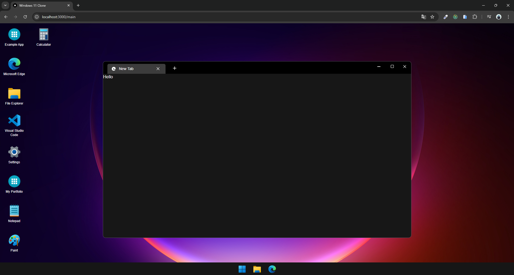

# WINDOWS 11 CLONE DOCUMENTATION

# Table of Contents

1. [Developer Workspace](#developer-workspace)
   1. [Conflict npm packages](#conflict-npm-packages)
   2. [Add more apps](#add-more-apps)
   3. [Firebase setup](#firebase-setup)

## 💻 Developer Workspace <a name="developer-workspace"></a>

### 🛡️ Conflict npm packages <a name="conflict-npm-packages"></a>

This project use somes old node version npm packages (< ver 18.), list is below. If you want to install more packages, you can choose some options:

1. Uninstall list below & install packages you want. Then reinstall.
2. Use `--force` tag after install command. For example: `npm i uuid --force`.

```console
# react-canvas-draw (This package need install more @types package for Typescript)
npm install react-canvas-draw@1.2.1 --force
npm i --save-dev @types/react-canvas-draw@1.2.3 --force
```

### ⌨️ Add more apps for project <a name="add-more-apps"></a>

You are developer & want to improve this project. Follow these steps:

1. Go to `WindowContainer.tsx` file, this includes app profile on desktop page, add new object like this:


2. Declare app name in file `utils.ts`


Your new app will display on desktop:




3. You can develop & put new app content file for `targetElement` with url: `src/components/WindowContentCpn`:


### 🔥 Firebase setup <a name="firebase-setup"></a>

**Make sure that you have enabled following firebase services:**

- Storage
- Firestore Database
- Authentication (project default use email & password only)

**1. Storage have default structure:**

- `file_explorer/pictures`
- `file_explorer/music`
- `file_explorer/videos`


Picture files (.png, .jpg,...) example (same for videos & music files)


**2. Firestore Database**

- type list: ["text_document", "pictures", "videos", "music"]
- content is url for: `pictures`, `videos`, `music` (provided by Storage)


